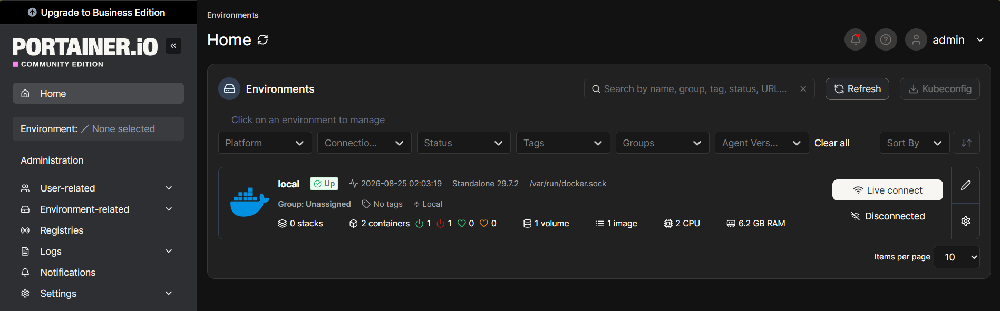
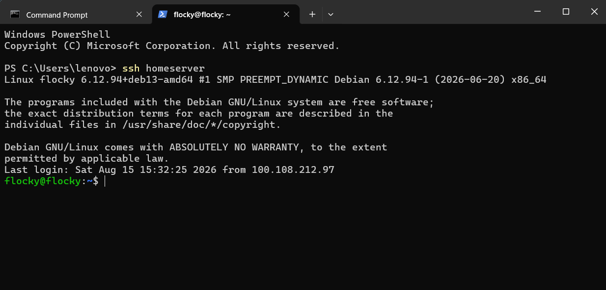
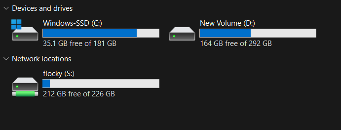
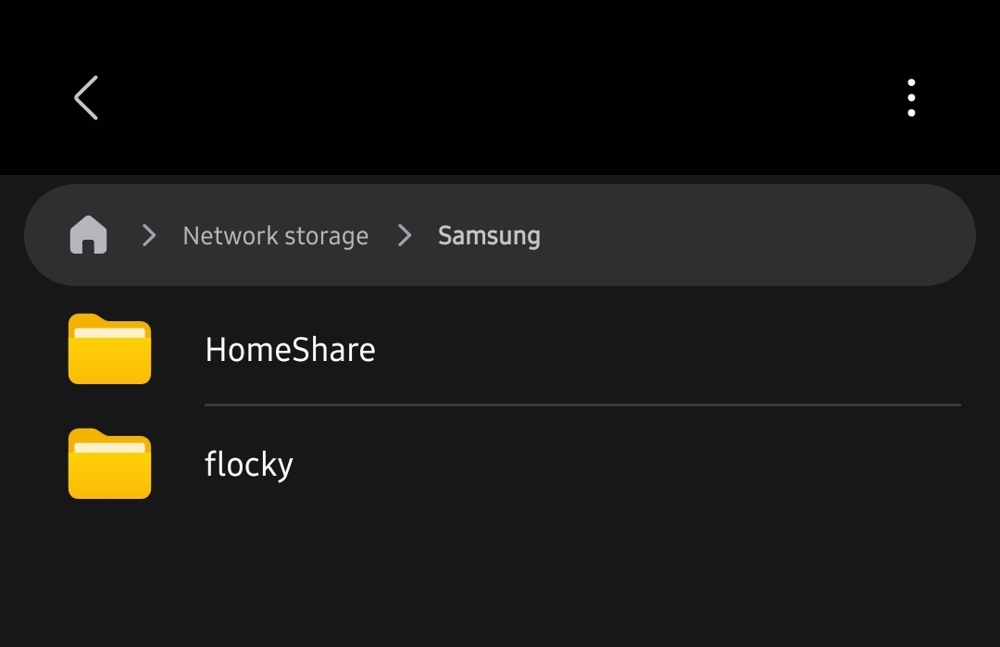
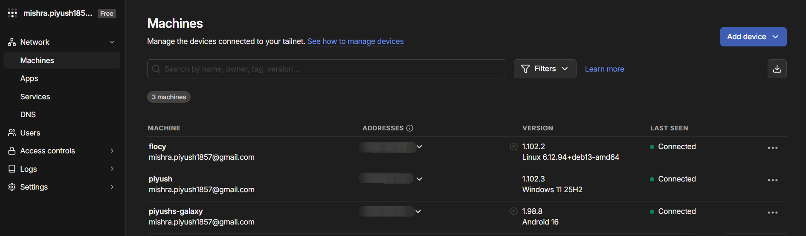

# Personal Home Server

A repurposed laptop configured as a production-grade personal server with remote access, network-attached storage, and a containerized service environment. Built as an alternative to renting cloud infrastructure.

---

## Overview

This project transforms a spare laptop into a fully functional Linux server accessible from anywhere in the world. The server runs headless Debian 13, is managed entirely over SSH, and provides network storage accessible from Windows, Android, and any other device on any network.

The infrastructure is comparable to what cloud providers offer as a paid service, built and operated at zero recurring cost.

---

## Cloud Equivalent

### Compute

| Spec | This Server | AWS EC2 t3.large |
|---|---|---|
| CPU | AMD Athlon Silver 3050U | Intel Xeon Platinum 8000 |
| Cores | 2 | 2 vCPUs |
| RAM | 8 GB | 8 GiB |
| OS | Debian 13 (headless) | Linux (AMI of choice) |
| Remote Access | SSH over Tailscale VPN | SSH over EC2 Connect / VPN |

### Storage

| Spec | This Server | AWS EBS (gp3) |
|---|---|---|
| Type | Physical SSD | Network block storage |
| Capacity | 226 GB | Provisioned per GB |
| File Sharing | Samba (SMB) | Requires manual setup |
| Protocol | SMB — native on Windows/Android | No built-in file sharing |

### Monthly Cost Comparison

| Component | This Project | AWS Equivalent |
|---|---|---|
| Compute (t3.large) | $0 | ~$60.74 / month |
| Storage — 226 GB (EBS gp3 @ $0.08/GB) | $0 | ~$18.08 / month |
| Data transfer & egress | $0 | ~$5–10 / month |
| **Total** | **$0 / month** | **~$80–90 / month** |

---

## Advantages Over Cloud

Beyond cost, this setup has meaningful technical advantages over a comparable cloud instance:

- **No egress fees.** Cloud providers charge for data transferred out of their network. This server transfers data freely over your home internet connection.
- **Full physical control.** No hypervisor layer, no shared tenancy, no underlying infrastructure you cannot inspect.
- **No CPU credit throttling.** AWS T-series instances use a CPU credit model — sustained high CPU usage gets throttled. This server runs at full CPU capacity without restriction.
- **Larger usable storage per dollar.** A 226 GB EBS volume costs ~$18/month on AWS, provisioned whether used or not. This server's storage costs nothing and is physically attached.
- **Privacy.** Data never leaves hardware you own. No cloud provider terms of service apply to stored data.
- **No cold start.** Cloud instances that are stopped and restarted can take 30–60 seconds. This server is always running.

---

## Screenshots

### Portainer Dashboard


### SSH Remote Access


### Network Drive on Windows


### Storage on Android


### Tailscale Connected Devices


---

## Technical Details

### System Specifications

| Component | Details |
|---|---|
| Device | ASUS Laptop (repurposed) |
| CPU | AMD Athlon Silver 3050U — 2 cores at 2.3 GHz |
| RAM | 8 GB |
| Storage | 226 GB SSD |
| OS | Debian 13, headless (no GUI) |
| Architecture | x86\_64 |

---

### Stack

| Tool | Role |
|---|---|
| Debian 13 | Server operating system |
| OpenSSH | Encrypted remote terminal access |
| UFW | Firewall — controls inbound and outbound traffic |
| Fail2ban | Brute force attack mitigation |
| Tailscale | VPN tunnel for secure remote access over the internet |
| Samba | SMB file sharing — exposes storage to Windows and Android |
| Docker | Container runtime |
| Portainer CE | Browser-based Docker management dashboard |

---

### Security Configuration

**SSH**
- Password authentication disabled entirely
- Key-based authentication only using ED25519 keypair
- SSH config alias set up for streamlined access

**Firewall (UFW)**
- Default policy: deny all incoming traffic
- Allowed rules: OpenSSH, Samba
- Rules applied for both IPv4 and IPv6

**Fail2ban**
- Monitors SSH login attempts
- Bans any IP that fails authentication 5 times within 10 minutes
- Ban duration: 1 hour

**Tailscale VPN**
- All remote connections are routed through an encrypted private mesh network
- No ports are exposed to the public internet
- Every device requires explicit authentication before joining the network

**Power Management**
- Lid-close suspend disabled (`HandleLidSwitch=ignore`)
- Idle suspend disabled (`IdleAction=ignore`)
- Server runs continuously with the lid closed

---

### Network Storage

- Shared directory: `/home/flocky/shared` — 213 GB available
- Protocol: SMB via Samba
- Windows access: mapped as a permanent network drive (S:)
- Android access: Samsung Files app via SMB
- Remote access: works over any internet connection via Tailscale
- Authentication: Samba user credentials required

---

### Containerization

- Docker installed via the official install script
- Portainer Community Edition running as a persistent container with `--restart always`
- Portainer accessible from any device at `http://<tailscale-ip>:9000`
- All containers configured to restart automatically on server reboot

---

### Remote Access Architecture

```
Any device — any network
        |
        v
   Tailscale VPN
 (encrypted tunnel)
        |
        v
  Debian 13 Server
        |
   -----+------
   |           |
  SSH        Samba
(terminal)  (storage)
```

---

### Build Phases

| Phase | Description | Status |
|---|---|---|
| 1 | Server hardening — SSH, firewall, fail2ban, power management | Complete |
| 2 | Remote access — Tailscale VPN setup across all devices | Complete |
| 3 | Network storage — Samba share accessible from Windows and Android | Complete |
| 4 | Container infrastructure — Docker and Portainer | Complete |
| 5 | ML model serving — FastAPI and Ollama deployment | Planned |

---

### Planned — Phase 5

- Serve trained ML models as REST API endpoints using FastAPI
- Run lightweight LLMs locally using Ollama
- Expose model endpoints securely over the Tailscale network
- Manage all running services through the Portainer dashboard
